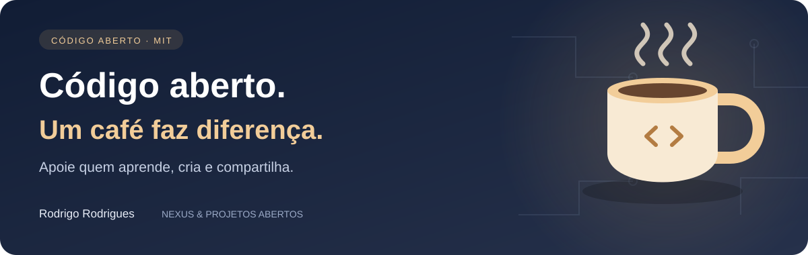

<p align="right">
  <a href="README.md"></a>
  <a href="README.en-US.md"></a>
  <a href="README.es-AR.md"></a>
</p>

# headers-seguros

## Segurança e compatibilidade

CSP imutável, rejeição de configuração malformada e controle de subdomínios HSTS.

Opções: `csp` (true, false ou mapa de diretivas para arrays de fontes; null/false remove uma diretiva), `hsts`, `hstsMaxAge`, `includeSubDomains`, `frame`, `referrer`, `permissions`. Padrão HSTS: 15552000 segundos e subdomínios. Use apenas em HTTPS; confirme todos os subdomínios antes de habilitar essa abrangência. `frame: SAMEORIGIN` também requer ajustar `frame-ancestors` na CSP. COOP/CORP podem afetar integrações externas. Não substitui autorização, proteção CSRF ou auditoria.

Baixe pelo GitHub; não é necessário instalar um pacote homônimo do npm. Para consumir em outro projeto, use uma revisão Git fixada (tag v1.2.1) ou copie o módulo e preserve a licença. Os exemplos abaixo usam importação local após o clone. Node.js 22 ou superior para os testes.

Cabeçalhos de segurança para serviços HTTP em Node.js — **sem dependências**.
Núcleo agnóstico (`construirHeaders`) + middleware para Express/Connect
(`headersSeguros`). Padrões restritivos e sensatos, cada um ajustável.

## Por quê

A maioria dos ataques de navegador (clickjacting, sniffing de MIME, injeção de
script, vazamento de referer) é mitigada por cabeçalhos que quase todo serviço
deveria enviar e muitos esquecem. Este módulo liga a base certa numa linha.

Define: `Content-Security-Policy`, `X-Content-Type-Options: nosniff`,
`X-Frame-Options`, `Referrer-Policy`, `Strict-Transport-Security`,
`Permissions-Policy`, `Cross-Origin-Opener-Policy`,
`Cross-Origin-Resource-Policy`, `Origin-Agent-Cluster` — e remove `X-Powered-By`.

## Instalação

```bash
git clone https://github.com/Rdraim/headers-seguros.git
cd headers-seguros
npm test
```

## Uso

```js
import express from 'express';
import { headersSeguros } from './src/index.js';

const app = express();
app.use(headersSeguros());               // padrões seguros
// ou ajustando a CSP:
app.use(headersSeguros({ csp: { 'img-src': ["'self'", 'https:', 'data:'] } }));
```

Sem framework:

```js
import { construirHeaders } from './src/index.js';
for (const [k, v] of Object.entries(construirHeaders())) res.setHeader(k, v);
```

## Opções

| opção | padrão | descrição |
|---|---|---|
| `csp` | `true` | `false` desliga; um objeto estende/sobrescreve as diretivas |
| `hsts` | `true` | `Strict-Transport-Security` (só use em HTTPS) |
| `hstsMaxAge` | `15552000` | validade do HSTS (segundos) |
| `frame` | `'DENY'` | `X-Frame-Options` (`DENY` ou `SAMEORIGIN`) |
| `referrer` | `'no-referrer'` | `Referrer-Policy` |
| `permissions` | `camera=(), microphone=(), geolocation=()` | `Permissions-Policy` |

> Ajuste a CSP ao seu app — uma política boa é restritiva por padrão e abre só o
> necessário. Teste em homologação antes de produção.

## Testes

```bash
npm test
```

## Licença

MIT © Rodrigo Rodrigues

## Manutenção e apoio

Código independente inspirado em problemas resolvidos no Nexus, projeto de Rodrigo Rodrigues. Não inclui banco, configuração privada, logs, dados de usuários ou credenciais. Evolução coordenada significa revisar mudanças relacionadas no mesmo ciclo; não há cópia automática de arquivos privados.

[Como contribuir](CONTRIBUTING.md) · [Segurança](SECURITY.md)

Referência oficial: https://developer.mozilla.org/en-US/docs/Web/HTTP/Headers/Content-Security-Policy


## Uso prático — 1.2.0

`cspReportOnly: true` permite avaliar a política antes de aplicá-la. Esse modo não bloqueia conteúdo; recebimento de relatórios exige configurar endpoint próprio. Opções booleanas rejeitam strings ambíguas.

Exemplo executável com dados sintéticos: `node examples/uso.mjs`.

---

<p align="center">
  
</p>

## ☕ Me pague um café

Este projeto te ajudou a resolver um problema, aprender algo novo ou dar os primeiros passos no desenvolvimento? Se você sentir vontade de apoiar meu trabalho, um café é uma forma carinhosa de agradecer.

Sou **Rodrigo Rodrigues**, criador do **Nexus** e destes projetos de código aberto. Seu apoio me ajuda a dedicar tempo para melhorar o código, escrever exemplos mais claros e continuar compartilhando o que aprendo.

**Contribua com o valor que fizer sentido para você. O apoio é totalmente voluntário — o projeto continua gratuito sob a licença MIT.**

<p>
  <a href="#apoie-com-pix"></a>
  <a href="https://github.com/Rdraim/headers-seguros/issues/new?title=Coment%C3%A1rio%3A%20este%20projeto%20me%20ajudou"></a>
</p>

### Apoie com Pix

No aplicativo do seu banco, escaneie o QR Code ou copie a chave Pix abaixo. Escolha o valor e confira os dados do destinatário antes de confirmar.

<p align="center">
  
</p>

**Chave Pix**

```text
8875a24e-44d1-4c91-b6bb-62c9f0070955
```

Você também pode apoiar compartilhando o projeto, relatando um problema, melhorando a documentação ou deixando um comentário.

### Seu comentário também faz diferença

[Conte como o projeto te ajudou](https://github.com/Rdraim/headers-seguros/issues/new?title=Coment%C3%A1rio%3A%20este%20projeto%20me%20ajudou). Vou gostar de saber o que você criou, o que aprendeu e o que poderia ficar mais claro para quem está começando.

O comentário é bem-vindo com ou sem doação. Preserve sua privacidade: não publique comprovantes, dados pessoais, credenciais ou informações de usuários nas Issues.

---

**Obrigado por apoiar meu trabalho e me ajudar a continuar criando e compartilhando. ❤️**
